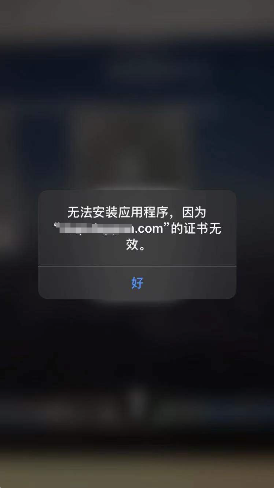

## 报证书无效



原因：plist文件地址必须为https协议，如  
```itms-services://?action=download-manifest&url=https://www.example.com/app.plist```

- plist, ipa文件都需要https
- plist 文件中的boundID, version 一定要与包匹配


https://support.apple.com/zh-cn/guide/deployment-reference-ios/apda0e3426d7/web
